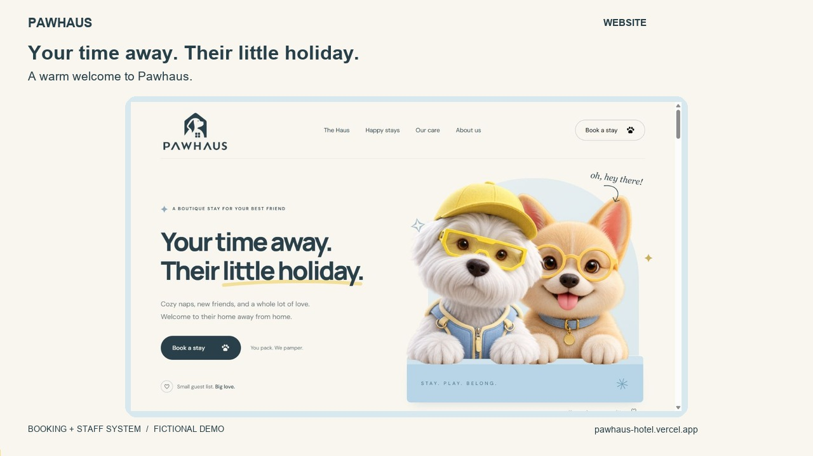
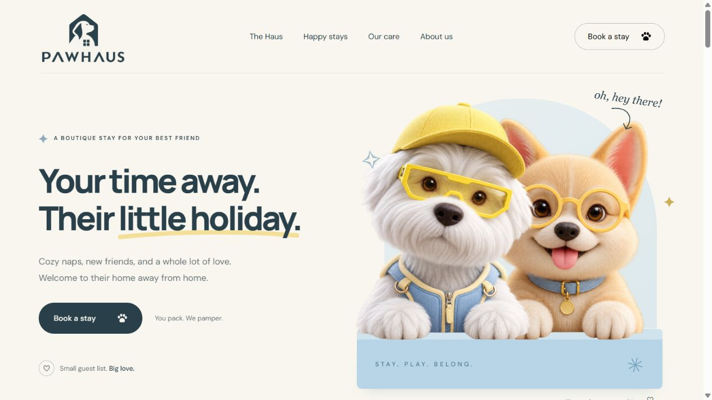
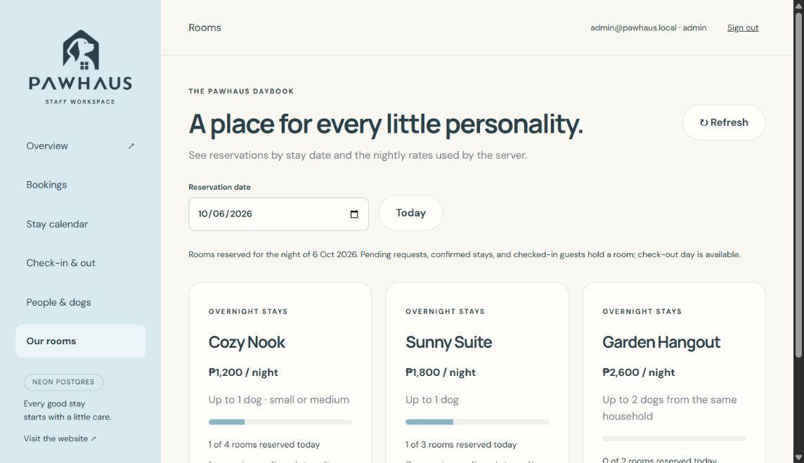

# Pawhaus

A responsive dog hotel website and a booking/staff workspace with Neon PostgreSQL and an offline SQLite option. The existing landing page and animations are preserved. The first backend slice follows `PAWHAUS-BUILD-PLAN.md`: requests, availability, server pricing, protected staff access, and controlled booking statuses.

## Screenshots

### Booking and staff walkthrough

[](docs/video/pawhaus-walkthrough.mp4)

[Download the 65-second landscape video](docs/video/pawhaus-walkthrough.mp4). This captioned mockup demonstrates a fictional booking, staff confirmation, check-in, the stay calendar, and room inventory. It uses an isolated local test database; no production customer records appear. No payment is collected.

### Landing page

[Visit Pawhaus](https://pawhaus-hotel.vercel.app/)



### Admin portal

The staff workspace includes bookings, a stay calendar, check-in and check-out, guest records, and room inventory. Staff sign-in is required.

[Open the staff portal](https://pawhaus-hotel.vercel.app/admin)



## Run locally

Requires **Node 24.15 or later** (uses built-in SQLite and TypeScript execution).

```sh
npm install
npm run dev
```

- Website: http://localhost:3000
- Staff portal: http://localhost:3000/admin
- Database: Neon when `.env` contains DATABASE_URL; otherwise `.data/pawhaus.sqlite`

The server binds to `127.0.0.1` by default. `PORT`, `HOST`, and `PAWHAUS_DB` are optional environment variables. The database is created automatically; it is never served as a website asset. Keep `.data` private and back it up. Stop the server before making a simple file backup so SQLite's WAL transactions are checkpointed.

## Staff access

Create an account in the configured database from the project folder:

```sh
npm run admin:create -- your-email@example.com
npm run admin:create -- reception@example.com FRONT_DESK
npm run admin:create -- care@example.com CARE_STAFF
```

Each command generates a random password and saves it in a private, Git-ignored `.data/staff-access-<timestamp>.txt` file. The password is not printed to the console. Store it in your password manager, then delete the credential file. The CLI does not overwrite an existing account. The initial account created during development is `admin@pawhaus.local`; its credential file is in `.data`.

ADMIN and FRONT_DESK can review and change booking status. CARE_STAFF can read bookings and care notes but cannot change status. Passwords use salted scrypt hashes. Sessions use random, revocable, eight-hour HttpOnly/SameSite cookies. Login attempts and booking submissions are rate limited. Mutations reject cross-site origins.

## What works

- Public form checks each reserved night against room inventory, then saves a PENDING booking with a reference number.
- Prices are recalculated on the server; client-supplied totals are ignored.
- Database transactions prevent overlapping requests from exceeding room capacity.
- Retrying a submission with the same request key returns the original booking.
- The responsive staff portal has an overview, searchable/filterable bookings, monthly calendar, today's check-ins/check-outs, guest records, and room inventory.
- Details include dog information, contact details, care notes, unpaid totals, and an activity log.
- Status changes use version checks, preventing a stale staff page from overwriting a newer change.

Status workflow:

```text
PENDING → CONFIRMED → CHECKED_IN → CHECKED_OUT
PENDING / CONFIRMED → CANCELLED
CONFIRMED → NO_SHOW
```

Pending, confirmed, and checked-in bookings reserve rooms. Check-out day is available to the next guest. Cancelled/no-show bookings free capacity. Check-in and no-show are blocked before the arrival date. Confirmation is an explicit staff approval **without payment collection**. All currency is PHP and business dates use Asia/Manila.

Starter inventory is 4 Cozy Nooks, 3 Sunny Suites, and 2 Garden Hangouts; rates are ₱1,200, ₱1,800, and ₱2,600 per night. These values are defined in `src/backend/domain.ts` and are illustrative. Cozy Nook accepts one small/medium dog; Garden Hangout accepts two dogs from the same household. Stays are 1–30 nights.

## Local versus Vercel

The public website and staff portal are deployed at https://pawhaus-hotel.vercel.app and https://pawhaus-hotel.vercel.app/admin. Static assets come from `dist`; `api/index.ts` hosts the booking API on Vercel Node 24 in Singapore. The production DATABASE_URL is a sensitive server-only Vercel variable. Preview deployments require their own database configuration.

Neon PostgreSQL is used locally and in production, with separate databases on the same branch/compute. `.env` holds local connections; ignored `.env.production.local` holds the production runtime connection and migration owner connection. Neither file is committed or uploaded. Existing staff accounts were preserved. See `docs/backend.md` for migration commands, roles and verification.

Payments, emails/SMS, customer accounts, editable inventory, rescheduling, services/daycare/grooming, CMS, and advanced staff/reporting features remain later phases. The public property imagery and testimonials are illustrative concept content.

## Checks

```sh
npm run check
npm test
npm run build
```

The tests use memory/temporary databases and cover invalid dates, server pricing, dog/room suitability, per-night capacity, retry protection, cancellation, status transitions, stale edits, persistence, authentication, authorization, cookies, and the HTTP booking-to-staff flow. Browser verification uses a separate `.data/verification.sqlite` database on port 3001; its fictional bookings never enter the real local workspace.

## Main files

- `public/index.html`: complete landing page.
- `public/admin/index.html`: staff portal shell.
- `src/server.mjs`: local static/API server.
- `src/backend/domain.ts`: validation, pricing, room inventory, status rules.
- `src/backend/store.ts`: persistent transactions, authentication, audit history.
- `src/backend/api.ts`: HTTP endpoints and staff authorization.
- `src/js/booking.js`: public booking flow, live local API or static demo.
- `src/js/admin.js`, `src/css/admin.css`: responsive staff interface.
- `migrations/001-local.sql`: local schema.
- `tests/bookings.test.ts`: domain, database, and HTTP tests.
